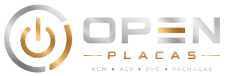

# Open Placas — Website Institucional

## Comunicação visual que transforma espaços em marcas de presença.

Website institucional desenvolvido para a **Open Placas**, empresa especializada em soluções de comunicação visual, fachadas comerciais e projetos personalizados para empresas de Brasília e Entorno.

O projeto foi criado com foco em uma presença digital profissional, apresentando os serviços da empresa de forma clara, moderna e estratégica, facilitando a conexão entre potenciais clientes e a equipe comercial.

---

# Sobre o projeto

A Open Placas desenvolve soluções em comunicação visual para empresas que desejam fortalecer sua identidade e valorizar seus espaços.

O website foi estruturado para apresentar os principais serviços da empresa:

- Fachadas comerciais;
- Letras caixa;
- ACM;
- Acrílico;
- PVC expandido;
- Neon LED;
- Comunicação visual personalizada.

Mais do que apresentar produtos, o projeto busca comunicar valor, qualidade e profissionalismo, mostrando como a comunicação visual pode transformar a percepção de uma marca.

---

# Objetivos do projeto

## Fortalecer a presença digital

Criar uma plataforma oficial para a empresa apresentar seus serviços e construir autoridade no ambiente digital.

## Atrair novos clientes

Facilitar o contato de empresas interessadas através de uma experiência simples e direcionada para orçamento.

## Valorizar projetos realizados

Apresentar trabalhos executados através de um portfólio visual, permitindo que novos clientes tenham uma percepção da qualidade dos serviços.

## Preparar a empresa para buscas locais

Estruturar o site para apoiar estratégias digitais voltadas para empresas de Brasília e Entorno.

---

# Funcionalidades desenvolvidas

✅ Layout responsivo para computadores, tablets e smartphones  
✅ Design premium alinhado à identidade visual da marca  
✅ Seção de serviços organizada por soluções oferecidas  
✅ Apresentação de fachadas comerciais  
✅ Portfólio visual de projetos realizados  
✅ Página institucional da empresa  
✅ Seção de contato direcionada para atendimento comercial  
✅ Política de Privacidade  
✅ Termos de Uso  
✅ SEO básico configurado  
✅ Sitemap e Robots configurados para mecanismos de busca  

---

# Tecnologias utilizadas

## Front-end

- Next.js
- React
- TypeScript
- CSS Modules

## Desenvolvimento e ferramentas

- Git
- GitHub
- Node.js
- Google Search Console
- Netlify

---

# Estrutura do projeto

app/
├── páginas e rotas da aplicação

components/
├── componentes reutilizáveis

lib/
├── configurações e recursos auxiliares

public/
├── imagens e arquivos estáticos

---

# Estratégia de desenvolvimento

O projeto foi desenvolvido considerando não apenas a criação de um site institucional, mas a construção de uma ferramenta digital para geração de oportunidades comerciais.

A estrutura foi pensada para conduzir o visitante através de uma jornada:

1. Conhecer a empresa;
2. Entender os serviços oferecidos;
3. Visualizar projetos realizados;
4. Criar confiança;
5. Entrar em contato para solicitar orçamento.

---

# Desenvolvimento

Projeto desenvolvido por:

## Code & Solutions

Soluções digitais personalizadas para empresas que buscam transformar ideias em produtos digitais.

---

# Próximas evoluções

Possíveis melhorias futuras:

- Integração com ferramentas de análise de visitantes;
- Monitoramento de conversões;
- Evolução contínua do SEO;
- Integrações comerciais;
- Área administrativa personalizada.

---

# Licença

Projeto desenvolvido exclusivamente para a **Open Placas**.

Todos os direitos reservados.